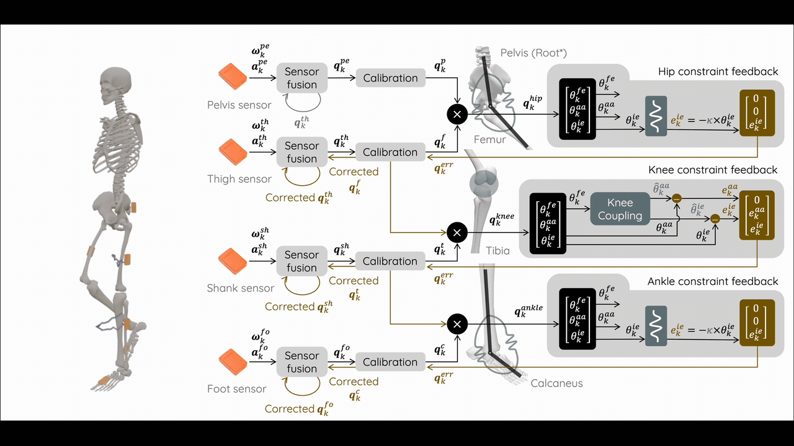

<div align="center">
  
</div>

# Biomechanics-Informed Inertial Tracking Achieves the Accuracy of Marker-Based Kinematics

[](https://imovelab.org/)
[](https://www.nature.com/articles/s41467-026-75981-y) 
[](https://figshare.com/s/3b31b5f932b865e52ad3)

**IMoveLab** is a workflow for human motion tracking with inertial measurement units (IMUs). 

## 📂 Structure
See `biplane_ref` for the implementation associated with Experiment 1 presented in the paper; `mocap_ref` for Experiments 2 and 3.

## ⚙️ Installation
The code was tested with `Python 3.10.19` on `Ubuntu 24.04` and `MacOS`. We recommend using `conda` to create a separate environment for running the code.
```
conda create --name imovelab python==3.10.19
conda activate imovelab
```

Run `python -m pip install -r requirements.txt` for dependencies.

See [AHRS](https://ahrs.readthedocs.io/en/latest/installation.html), [VQF](https://vqf.readthedocs.io/en/stable/installation.html), and [RIANN](https://github.com/daniel-om-weber/riann) regarding packages for state-estimation filters. 

See [Scripting in Python](https://opensimconfluence.atlassian.net/wiki/spaces/OpenSim/pages/53085346/Scripting+in+Python) regarding the `opensim` package for OpenSense biomechanical constrained inverse kinematics.

## 💾 Data
The dataset is available on [FigShare](https://figshare.com/s/3b31b5f932b865e52ad3).

See `README.md` in the `biplane_ref` or `mocap_ref` folder for how to store the data.

## 🚀 Run the Code
See `README.md` in the `biplane_ref` or `mocap_ref` folder for how to run the code.


## 🔑 License
IMoveLab is licensed under the [Carnegie Mellon Software License](https://github.com/CMU-MBL/IMoveLab/blob/main/LICENSE).


## 📝 Citation
Phan, V., Li, Z., Meinders, E., Gale, T., Anderst, W., Ng-Thow-Hing, J., Khandan, A., and Halilaj, E., "Biomechanics-Informed Inertial Tracking Achieves the Accuracy of Marker-based Kinematics," Nature Communications, [https://doi.org/10.1038/s41467-026-75981-y](https://doi.org/10.1038/s41467-026-75981-y) (2026).

## 📧 Contact
Please reach out to Vu Phan (vuphan@andrew.cmu.edu) or Eni Halilaj (ehalilaj@andrew.cmu.edu) for any questions regarding this work.


